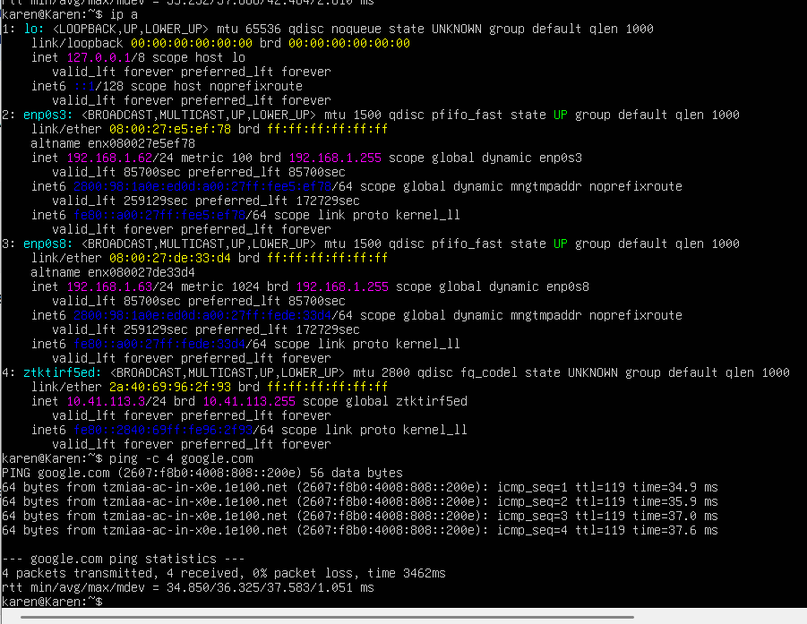
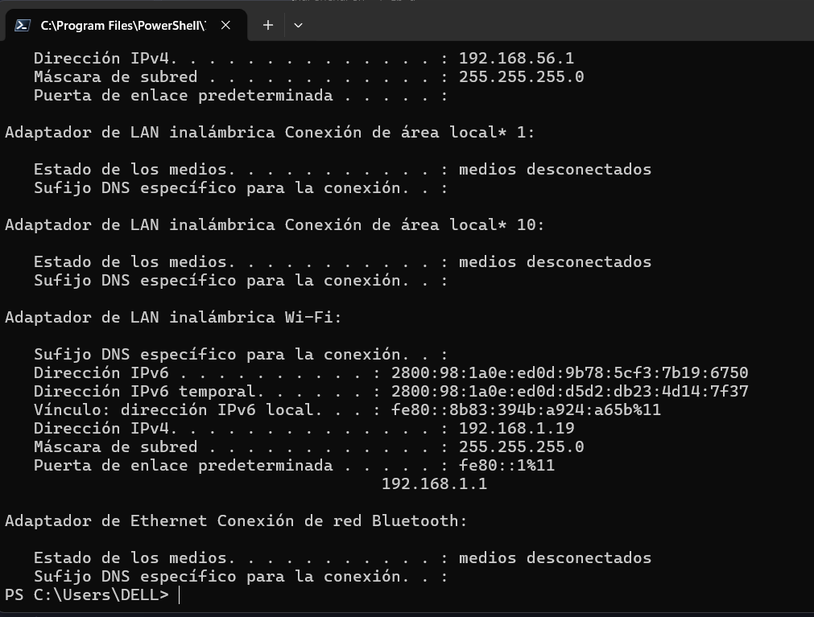
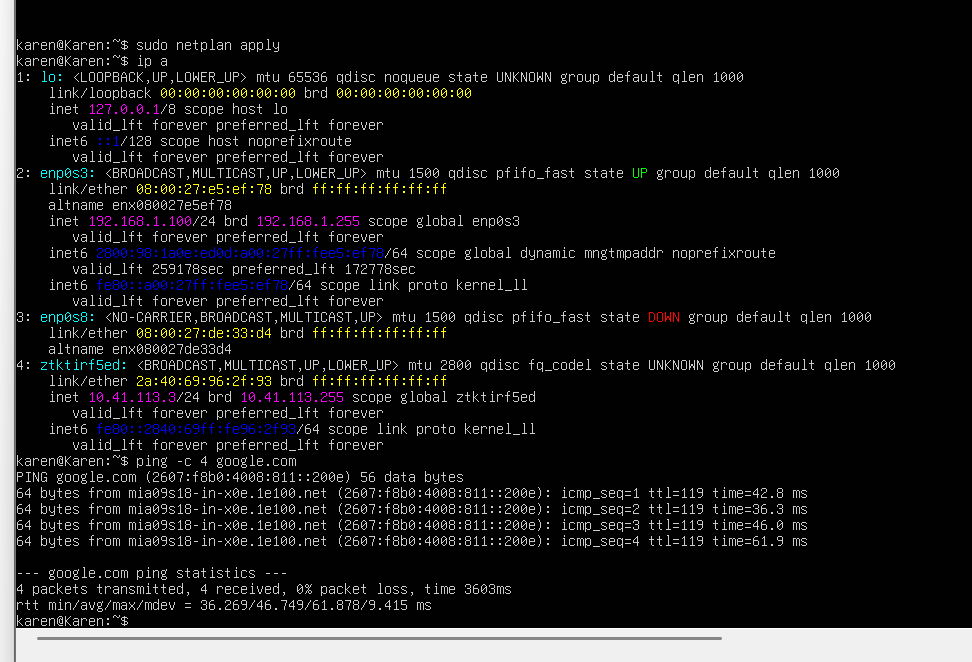
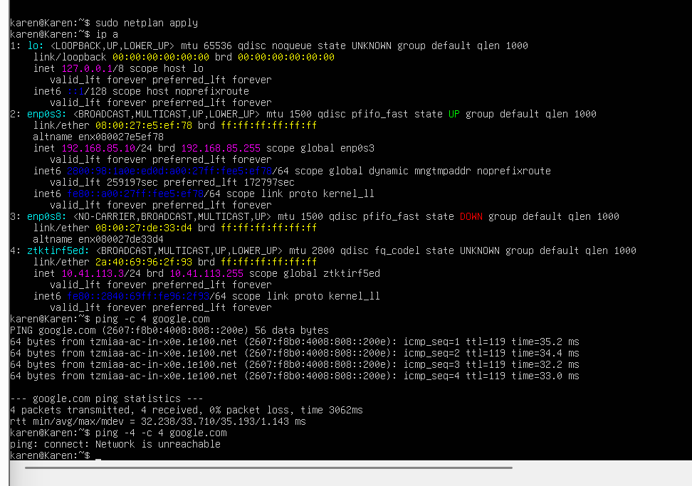

# HW-03 — Modos de red en máquina virtual

## Descripción

En esta práctica se configuró una máquina virtual con Ubuntu Server utilizando el modo de red **Bridge**. Se realizaron tres escenarios diferentes para observar el comportamiento de la conectividad al utilizar una dirección IP obtenida mediante DHCP, una dirección IP configurada manualmente dentro de la misma subred y una dirección IP configurada manualmente fuera de la subred del hipervisor.

También se configuró el hostname de la máquina virtual con el nombre solicitado.

---

## 1. Configuración del hostname

Se configuró el hostname de la máquina virtual con el nombre:

```bash
Karen
```

Para verificarlo se utilizó:

```bash
hostname
```

### Captura de pantalla


```md

```

---

## 2. Identificación de la subred del hipervisor

La computadora física utilizada como hipervisor se encuentra en la subred:

```text
192.168.1.0/24
```

La máscara `/24` corresponde a:

```text
255.255.255.0
```

Por lo tanto, los equipos dentro de esta red utilizan direcciones del tipo:

```text
192.168.1.X
```

### Captura de pantalla


```md

```

---

## 3. Escenario 1 — Bridge con DHCP

En el primer escenario se configuró la máquina virtual en modo **Bridge** y se permitió que la dirección IPv4 fuera asignada automáticamente mediante DHCP.

La máquina virtual obtuvo la dirección:

```text
192.168.1.62/24
```

Esto puede comprobarse porque la interfaz aparece con una dirección marcada como dinámica.

Para visualizar la configuración de red se utilizó:

```bash
ip a
```

Para verificar la conectividad con Internet se ejecutó:

```bash
ping -c 4 google.com
```

El resultado fue exitoso, obteniendo:

```text
4 packets transmitted, 4 received, 0% packet loss
```

Esto demuestra que la máquina virtual recibió correctamente una configuración de red mediante DHCP y tuvo conectividad con Internet.

### Captura de pantalla

```md

```

---

## 4. Escenario 2 — Bridge con IP manual dentro de la subred

En el segundo escenario se deshabilitó DHCP y se configuró manualmente una dirección IPv4 perteneciente a la misma subred que el hipervisor.

La dirección configurada fue:

```text
192.168.1.100/24
```

Esta dirección pertenece a:

```text
192.168.1.0/24
```

La configuración realizada en Netplan fue similar a la siguiente:

```yaml
network:
  version: 2
  ethernets:
    enp0s3: 
      dhcp4: false
      addresses:
        - 192.168.1.100/24
      routes:
        - to: default
          via: 192.168.1.1
      nameservers:
        addresses:
          - 8.8.8.8
          - 1.1.1.1
```

Posteriormente se aplicó la configuración:

```bash
sudo netplan apply
```

Se verificó la dirección asignada mediante:

```bash
ip a
```

Finalmente se comprobó la conectividad:

```bash
ping -c 4 google.com
```

El ping se ejecutó correctamente, demostrando que una dirección IP configurada manualmente dentro de la subred permite mantener conectividad con la red y con Internet, siempre que se configure también el gateway y los servidores DNS correspondientes.

### Captura de pantalla

```md

```

---

## 5. Escenario 3 — Bridge con IP manual fuera de la subred

En el tercer escenario se configuró manualmente la siguiente dirección IPv4:

```text
192.168.85.10/24
```

Esta dirección pertenece a la subred:

```text
192.168.85.0/24
```

Por lo tanto, no pertenece a la subred del hipervisor:

```text
192.168.1.0/24
```

Después de aplicar la configuración se verificó mediante:

```bash
ip a
```

Al ejecutar inicialmente:

```bash
ping -c 4 google.com
```

el ping respondió correctamente.

Sin embargo, se observó que la comunicación se estaba realizando mediante **IPv6**, ya que Google respondió utilizando direcciones IPv6 como:

```text
2607:f8b0:...
```

Por esta razón, aunque la dirección IPv4 configurada estaba fuera de la subred, la máquina virtual todavía conservaba conectividad mediante IPv6.

Para comprobar específicamente el funcionamiento de IPv4 se ejecutó:

```bash
ping -4 -c 4 google.com
```

El resultado fue:

```text
Network is unreachable
```

Esto demuestra que la dirección IPv4 `192.168.85.10/24` no tiene conectividad hacia Internet mediante IPv4, debido a que no pertenece a la misma subred que el gateway de la red.

### Captura de pantalla

```md

```

---

## Explicación de los parámetros utilizados

### Dirección IP

La dirección IP identifica a un dispositivo dentro de una red.

Ejemplo:

```text
192.168.1.100
```

### Máscara `/24`

La notación:

```text
/24
```

equivale a:

```text
255.255.255.0
```

y permite determinar qué parte de la dirección identifica a la red y qué parte identifica al dispositivo.

Por ejemplo:

```text
192.168.1.100/24
```

pertenece a:

```text
192.168.1.0/24
```

### Gateway

El gateway utilizado fue:

```text
192.168.1.1
```

El gateway funciona como la puerta de salida hacia otras redes. Cuando un equipo necesita comunicarse con una dirección que no pertenece a su propia red local, envía el tráfico al gateway.

### DNS

Se configuraron los siguientes servidores DNS:

```text
8.8.8.8
1.1.1.1
```

Los servidores DNS permiten traducir nombres de dominio como:

```text
google.com
```

a direcciones IP que pueden ser utilizadas por los equipos para establecer la comunicación.

### DHCP

DHCP permite que un dispositivo obtenga automáticamente parámetros de red como:

* Dirección IP
* Máscara de subred
* Gateway
* Servidores DNS

En el primer escenario estos valores fueron asignados automáticamente, mientras que en los siguientes escenarios se configuraron manualmente.

---

## Conclusión

Esta práctica permitió comprobar el funcionamiento del modo Bridge en una máquina virtual y observar la diferencia entre utilizar DHCP y configurar una dirección IP manualmente.

Cuando la máquina virtual utiliza DHCP, la configuración de red se obtiene automáticamente. Al configurar una IP manual dentro de la misma subred, la máquina virtual puede mantener conectividad siempre que los parámetros de red sean correctos.

Finalmente, al utilizar una dirección IPv4 fuera de la subred, se comprobó que no existe conectividad mediante IPv4 hacia Internet. También se observó que IPv4 e IPv6 funcionan de manera independiente, ya que inicialmente fue posible realizar ping a Google mediante IPv6 aunque la configuración IPv4 fuera incorrecta.
