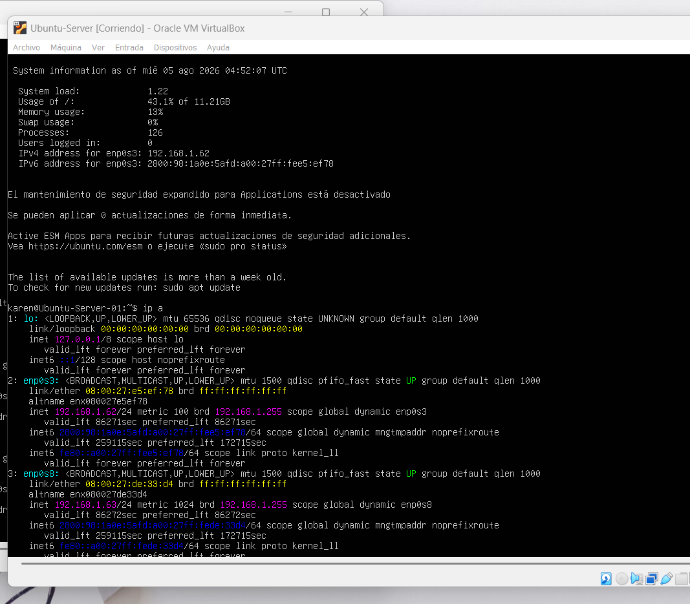
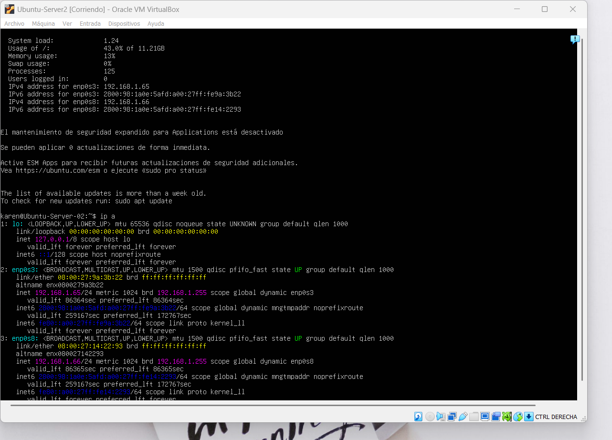

# Virtualizaci-n

# HW-02: Communication Between Virtual Servers

## Objective

Configure two Ubuntu Server virtual machines with IP addresses belonging to the home network subnet, assign a unique hostname to each server, and verify communication between them using ICMP ping.

## Network Configuration

### Ubuntu Server 01

- Hostname: `Ubuntu-Server-01`
- IPv4 Address: `192.168.1.62/24`
- Network: `192.168.1.0/24`

### Ubuntu Server 02

- Hostname: `Ubuntu-Server-02`
- IPv4 Address: `192.168.1.65/24`
- Network: `192.168.1.0/24`

## Connectivity Test

A ping was performed from `Ubuntu-Server-01` to `Ubuntu-Server-02` using the IP address `192.168.1.65`.

ping -c 4 192.168.1.65

