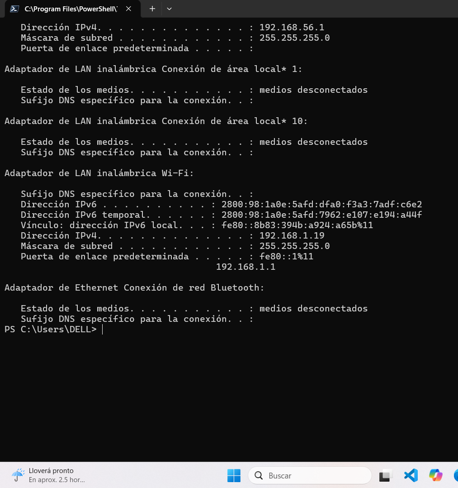
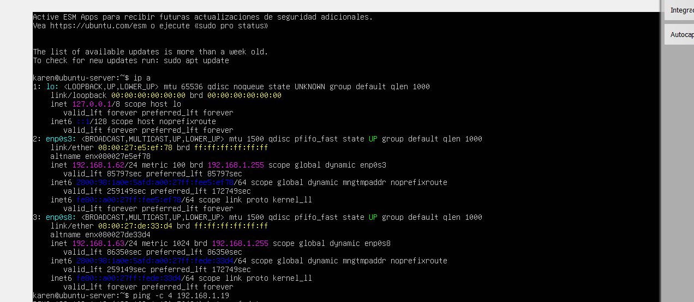

# Virtualizati-n

# HW-01: Host and Virtual Server Communication

## Objective

Configure the Ubuntu Server virtual machine to communicate with the local host through the same home network subnet.

## Network Configuration

### Local Host

- IPv4 Address: `192.168.1.19`
- Subnet Mask: `255.255.255.0`
- Default Gateway: `192.168.1.1`

### Ubuntu Server

The Ubuntu Server virtual machine has two active network interfaces:

- `enp0s3`: `192.168.1.62/24`
- `enp0s8`: `192.168.1.63/24`

Both interfaces belong to the `192.168.1.0/24` subnet.

## Connectivity Test

A ping was performed from the Ubuntu Server to the local host using the host's IPv4 address:

ping -c 4 192.168.1.19

