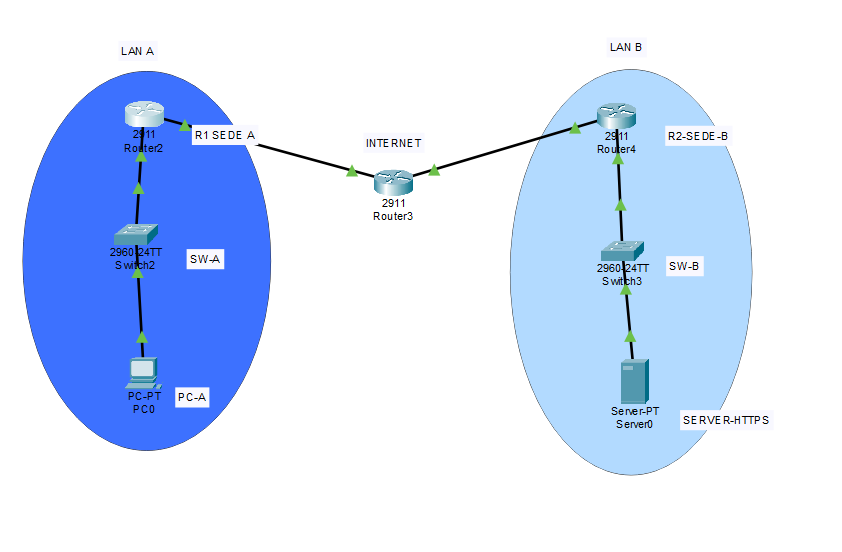
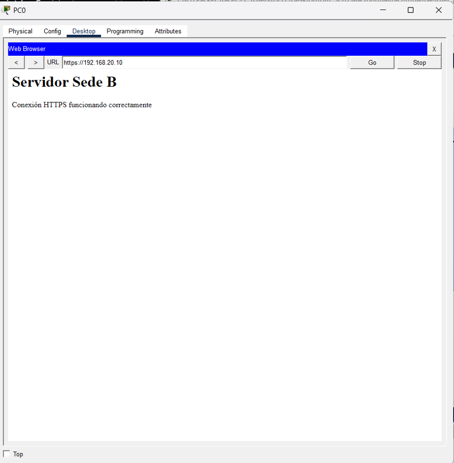
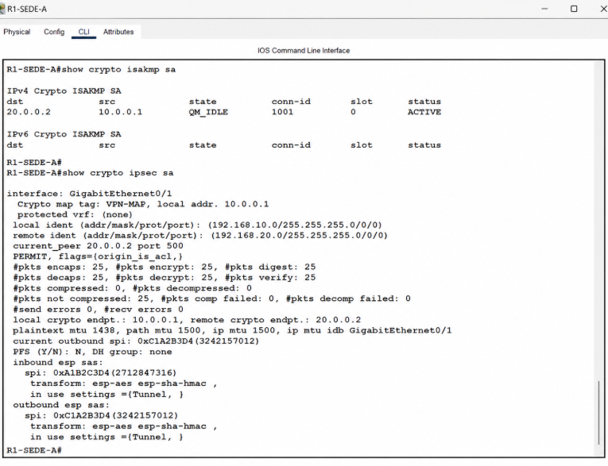

# HW-04 - IPSec Site-to-Site

## Descripción

En esta práctica se configuraron dos redes con subredes diferentes, conectadas mediante un router que simula Internet.

Las redes utilizadas fueron:

* Red A: `192.168.10.0/24`
* Red B: `192.168.20.0/24`
* R1-SEDE-A (WAN): `10.0.0.1`
* R2-SEDE-B (WAN): `20.0.0.2`
* Servidor HTTPS: `192.168.20.10`

La comunicación se realiza desde una computadora ubicada en la Red A hacia un servidor web ubicado en la Red B.

```text
PC-A -- SW-A -- R1-SEDE-A -- R-INTERNET -- R2-SEDE-B -- SW-B -- SERVER-HTTPS
```

## Topología

La siguiente imagen muestra la topología utilizada para la práctica:



## Prueba HTTPS

Desde la computadora ubicada en la Red A se realizó una solicitud HTTPS al servidor ubicado en la Red B mediante la dirección:

`https://192.168.20.10`

El servidor respondió correctamente mostrando el mensaje:

**Servidor Sede B**

**Conexión HTTPS funcionando correctamente**

### Evidencia HTTPS



## IPSec

La práctica utiliza una VPN IPSec Site-to-Site entre los routers `R1-SEDE-A` y `R2-SEDE-B`.

El túnel IPSec se configura utilizando **tunnel mode**, con el objetivo de proteger la comunicación entre las siguientes redes:

* `192.168.10.0/24`
* `192.168.20.0/24`

El router `R-INTERNET` simula la conexión a Internet entre ambas redes.

## Verificación del túnel IPSec

La siguiente evidencia muestra la verificación del túnel IPSec configurado entre ambos routers:



## Archivo Packet Tracer

El archivo de configuración de Cisco Packet Tracer correspondiente a la práctica se encuentra incluido en esta rama:

`hw-04-ipsec.pkt`
