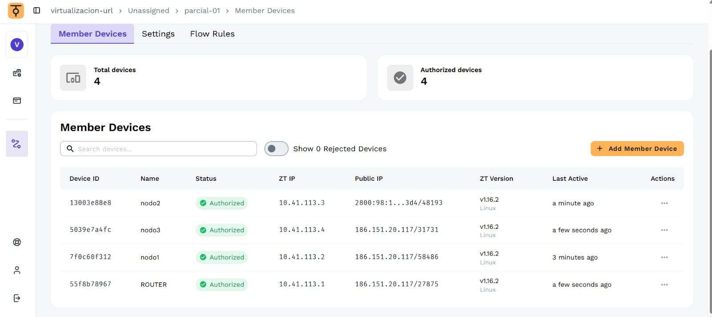
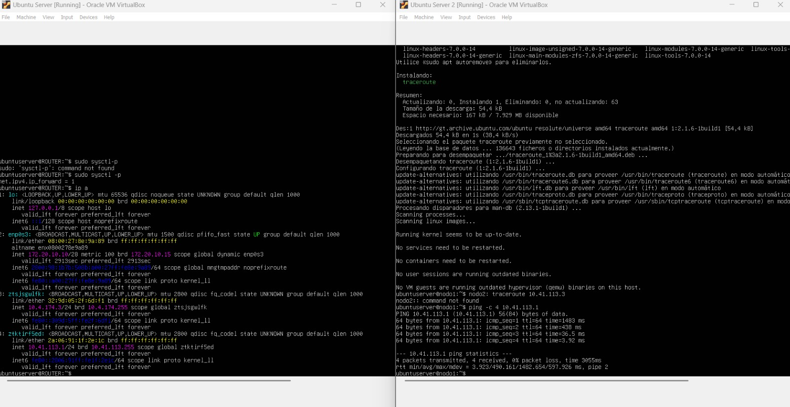

# Parcial 01 — Red SDN con ZeroTier y configuración de router
Karla Elizabeth Lopez Avila -1510421
Allan Eduardo Perez Ajanel -1501321
Karen Floridalma Laines Pablo -1520722
## Descripción

En este parcial se configuró una red SDN (Software Defined Network) utilizando ZeroTier, conectando cuatro máquinas virtuales con Ubuntu Server 26.04 LTS en VirtualBox. Una de las máquinas fue configurada como router habilitando el reenvío de paquetes IPv4 (IP Forwarding), y se verificó la conectividad entre todos los nodos mediante ping y traceroute.

## Ping desde el servidor virtual hacia el host

Una vez configuradas ambas IPs en la misma subred, se ejecutó el ping desde la maquina virtual hacia el equipo anfitrión para comprobar la conectividad.

```bash
ping X.X.X.X -c 4
=======
| Hostname | IP ZeroTier     | Rol    |
|----------|-----------------|--------|
| ROUTER   | 10.41.113.1     | Router |
| nodo1    | 10.41.113.2     | Nodo   |
| nodo2    | 10.41.113.3     | Nodo   |
| nodo3    | 10.41.113.4     | Nodo   |

- **Red ZeroTier:** `f3797ba7a869532b`
- **Subred:** `10.41.113.0/24`

---

## Configuración de ZeroTier

Se creó una red en [my.zerotier.com](https://my.zerotier.com) y se unieron las cuatro máquinas virtuales con el comando:

```bash
sudo zerotier-cli join f3797ba7a869532b


Los cuatro dispositivos fueron autorizados desde ZeroTier Central y se les asignaron IPs estáticas dentro de la subred `10.41.113.0/24`.



---

## Configuración del ROUTER

Se habilitó el reenvío de paquetes IPv4 en la máquina ROUTER para que actúe como router dentro de la red SDN.

```bash
sudo sysctl -w net.ipv4.ip_forward=1
echo "net.ipv4.ip_forward=1" | sudo tee -a /etc/sysctl.conf
sudo sysctl -p
```


---

## Configuración de rutas en nodo1

Se configuraron rutas estáticas en nodo1 para que el tráfico hacia nodo2 y nodo3 pase a través del ROUTER:

```bash
sudo ip route add 10.41.113.3/32 via 10.41.113.1
sudo ip route add 10.41.113.4/32 via 10.41.113.1
```

---

## Verificación de conectividad

### Ping desde nodo1 hacia ROUTER

```bash
ping -c 4 10.41.113.1
```



---

### Ping desde nodo1 hacia nodo2 y nodo3

```bash
ping -c 4 10.41.113.3
ping -c 4 10.41.113.4
```


---

### Traceroute — tráfico a través del ROUTER

El traceroute confirma que el tráfico de nodo1 hacia nodo2 y nodo3 pasa por el ROUTER (10.41.113.1) antes de llegar al destino.

```bash
traceroute 10.41.113.3
traceroute 10.41.113.4
```


---

## Resumen de IPs

* ROUTER: 10.41.113.1 — IP Forwarding habilitado
* nodo1: 10.41.113.2
* nodo2: 10.41.113.3
* nodo3: 10.41.113.4
