# Assessment 02 - Kubernetes, MetalLB y Traefik

## Descripción

En esta evaluación se configuró un clúster local de Kubernetes utilizando Minikube.

Se instalaron MetalLB y Traefik con el objetivo de disponer de un único punto de entrada para cuatro aplicaciones web.

MetalLB proporciona una dirección IP al servicio `LoadBalancer` de Traefik. Posteriormente, Traefik utiliza reglas de Ingress para identificar el nombre de dominio solicitado y enviar el tráfico al Service correspondiente.

La arquitectura implementada es la siguiente:

```text
app1.local ──┐
app2.local ──┤
app3.local ──┼──> Traefik ──> Services ──> Pods ──> Nginx
app4.local ──┘
```

---

## 1. Clúster de Kubernetes

Se utilizó un clúster local de Kubernetes creado mediante Minikube.

El estado del nodo puede verificarse con:

```bash
kubectl get nodes
```

El clúster posee un nodo local denominado `minikube`.

---

## 2. Instalación y configuración de MetalLB

MetalLB fue instalado dentro de su propio namespace:

```text
metallb-system
```

La instalación se realizó utilizando los manifiestos de Kubernetes de MetalLB.

Para verificar los Pods:

```bash
kubectl get pods -n metallb-system
```

Los componentes principales quedaron en estado `Running`.

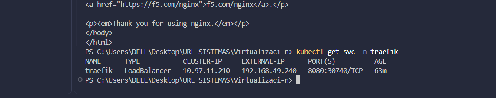

### IPAddressPool

La red virtual utilizada por Minikube es:

```text
192.168.49.0/24
```

La IP del nodo Minikube es:

```text
192.168.49.2
```

Se configuró un pool de una única dirección IP para MetalLB:

```text
192.168.49.240/32
```

La configuración fue realizada como IaC mediante un recurso `IPAddressPool`.

También se configuró un `L2Advertisement` para anunciar la dirección dentro de la red.

Para verificar el pool:

```bash
kubectl get ipaddresspools -n metallb-system
```

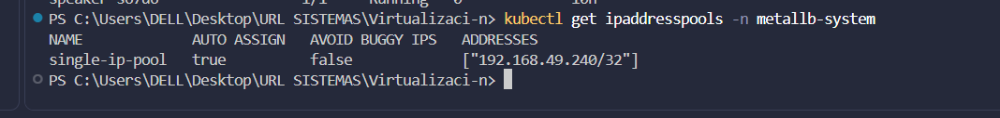

---

## 3. Instalación y configuración de Traefik

Traefik fue instalado dentro de su propio namespace:

```text
traefik
```

Se configuraron mediante YAML los siguientes recursos:

- Namespace
- ServiceAccount
- ClusterRole
- ClusterRoleBinding
- Deployment
- Service tipo LoadBalancer
- IngressClass

El Service de Traefik fue configurado como:

```yaml
type: LoadBalancer
```

MetalLB asignó a dicho Service la IP:

```text
192.168.49.240
```

Para comprobarlo:

```bash
kubectl get svc -n traefik
```

La configuración utilizada expone el servicio localmente utilizando el puerto `8080`.

```text
192.168.49.240:8080
```

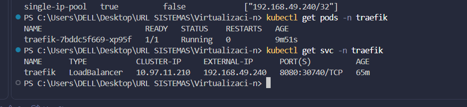

---

## 4. Namespace de las aplicaciones

Los Deployments y Services de las aplicaciones fueron creados dentro del namespace:

```text
parcial-kflp
```

Este namespace se encuentra separado de los namespaces utilizados por Traefik y MetalLB.

---

## 5. Deployments

Se crearon cuatro Deployments independientes:

```text
app1
app2
app3
app4
```

Cada Deployment ejecuta una aplicación web basada en Nginx.

La imagen utilizada fue:

```text
nginx:latest
```

Nginx escucha internamente en el puerto:

```text
80
```

Los Deployments pueden verificarse utilizando:

```bash
kubectl get deployments -n parcial-kflp
```

o:

```bash
kubectl get pods -n parcial-kflp
```

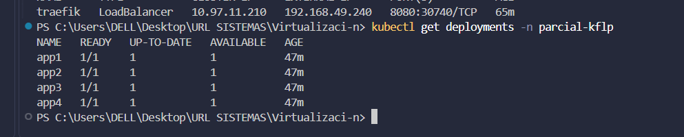

---

## 6. Services

Se creó un Service por cada Deployment:

```text
app1-service
app2-service
app3-service
app4-service
```

Cada Service selecciona los Pods correspondientes mediante labels.

Ejemplo:

```yaml
selector:
  app: app1
```

Esto permite que `app1-service` envíe las peticiones únicamente hacia los Pods pertenecientes a `app1`.

Los Services son internos al clúster y pueden comprobarse mediante:

```bash
kubectl get svc -n parcial-kflp
```

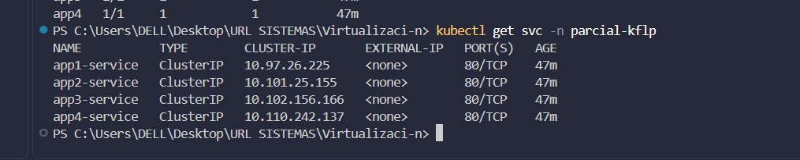

---

## 7. Configuración de Ingress

Se configuró Traefik como Ingress Controller mediante una `IngressClass`.

Posteriormente se creó un recurso `Ingress` dentro del namespace:

```text
parcial-kflp
```

Se configuraron las siguientes reglas:

```text
app1.local -> app1-service
app2.local -> app2-service
app3.local -> app3-service
app4.local -> app4-service
```

Todos los Services utilizan el puerto 80 internamente.

La configuración puede verificarse con:

```bash
kubectl get ingress -n parcial-kflp
```

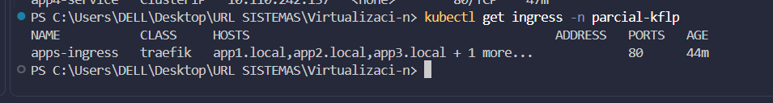

---

## 8. Configuración de DNS local

Se configuraron cuatro nombres de dominio locales.

Debido a que el ambiente utiliza Windows con Minikube ejecutándose mediante el driver de Docker, el acceso desde el host se realizó utilizando `minikube tunnel`.

Se modificó el archivo:

```text
C:\Windows\System32\drivers\etc\hosts
```

agregando:

```text
127.0.0.1 app1.local
127.0.0.1 app2.local
127.0.0.1 app3.local
127.0.0.1 app4.local
```

Posteriormente se limpió la caché DNS mediante:

```powershell
ipconfig /flushdns
```

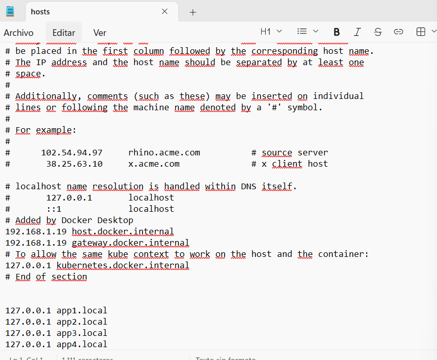

### Nota sobre MetalLB y Minikube

MetalLB asignó correctamente la IP:

```text
192.168.49.240
```

al Service LoadBalancer de Traefik.

Sin embargo, debido al uso de Minikube con el driver Docker sobre Windows, la red `192.168.49.0/24` pertenece a la red virtual utilizada por Docker.

Por este motivo se utilizó:

```bash
minikube tunnel
```

para permitir el acceso desde el sistema host hacia los servicios del clúster.

El proceso debe permanecer ejecutándose mientras los servicios sean accedidos desde el navegador.

---

## 9. Pruebas

Se verificó inicialmente el acceso mediante `curl`.

Ejemplo:

```bash
curl http://app1.local:8080
```

La respuesta obtenida corresponde al servidor Nginx:

```html
<h1>Welcome to nginx!</h1>
```

Esto confirma el flujo:

```text
Dominio
   |
   v
Traefik LoadBalancer
   |
   v
Ingress
   |
   v
Service
   |
   v
Pod
   |
   v
Nginx
```

---

## 10. Evidencias de acceso mediante nombres de dominio

### Aplicación 1

Dirección:

```text
http://app1.local:8080
```

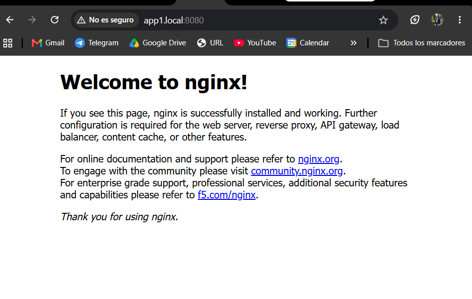

### Aplicación 2

Dirección:

```text
http://app2.local:8080
```

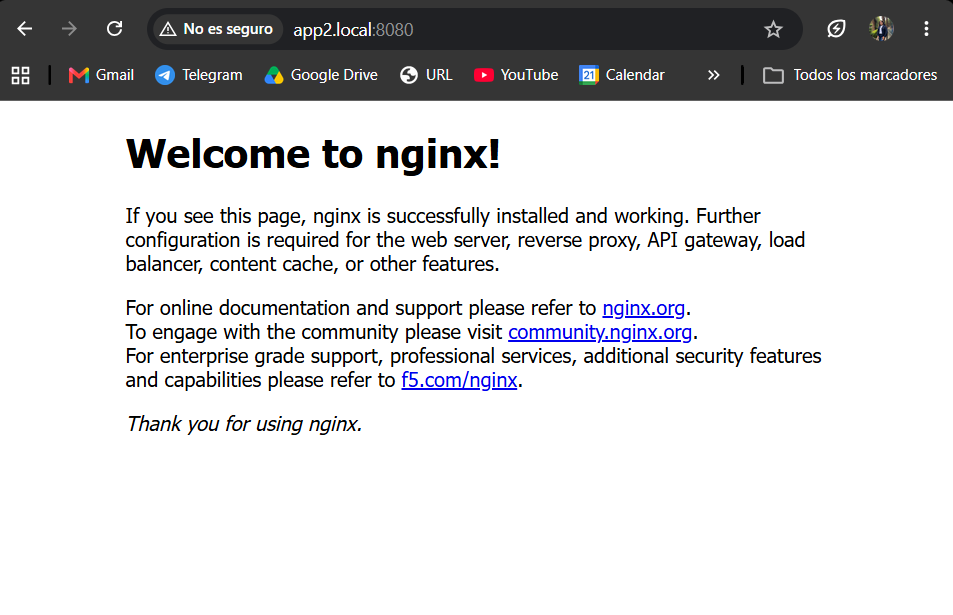

### Aplicación 3

Dirección:

```text
http://app3.local:8080
```

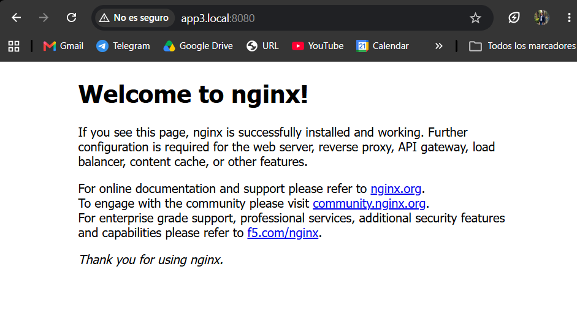

### Aplicación 4

Dirección:

```text
http://app4.local:8080
```

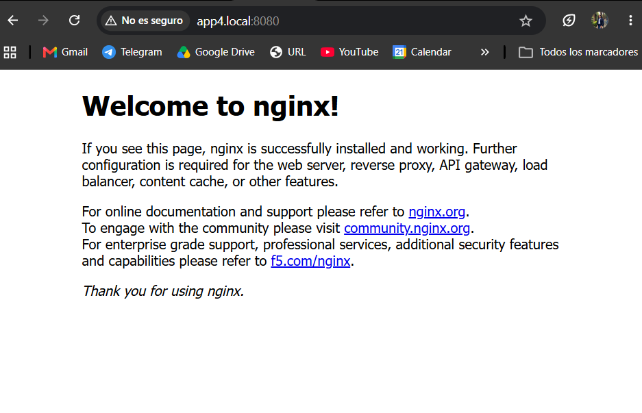

---

## Arquitectura final

```text
                       MetalLB
                          |
                    192.168.49.240
                          |
                          v
                 Traefik LoadBalancer
                          |
                          v
                       Traefik
                          |
                       Ingress
                          |
          +---------------+---------------+
          |               |               |
          v               v               v
     app1.local       app2.local      app3.local       app4.local
          |               |               |                |
          v               v               v                v
   app1-service     app2-service     app3-service      app4-service
          |               |               |                |
          v               v               v                v
       Pod app1         Pod app2         Pod app3          Pod app4
          |               |               |                |
          +---------------+---------------+----------------+
                          |
                         Nginx
```

---

## Estructura de archivos

```text
.
├── metallb/
│   └── metallb-config.yaml
│
├── traefik/
│   ├── traefik.yaml
│   └── ingress-class.yaml
│
├── apps/
│   ├── namespace.yaml
│   ├── apps.yaml
│   └── ingress.yaml
│
├── images/
│   ├── metallb-pods.png
│   ├── metallb-pool.png
│   ├── traefik.png
│   ├── deployments.png
│   ├── services.png
│   ├── ingress.png
│   ├── hosts.png
│   ├── app1.png
│   ├── app2.png
│   ├── app3.png
│   └── app4.png
│
└── README.md
```

---

## Resultado

Se implementó una arquitectura local de Kubernetes donde cuatro aplicaciones web son accedidas mediante nombres de dominio diferentes y gestionadas por Traefik utilizando un único punto de entrada.

MetalLB proporciona la dirección IP al Service LoadBalancer de Traefik y Traefik realiza el enrutamiento de cada dominio hacia el Service correspondiente.