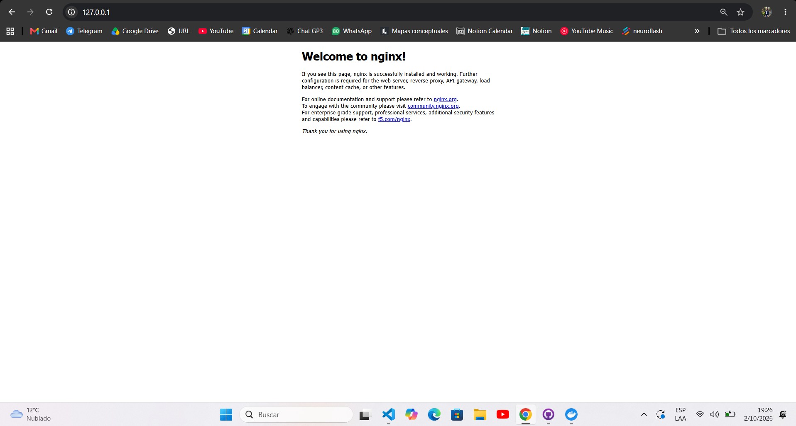
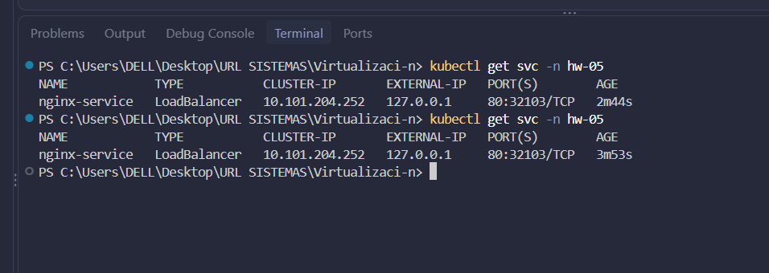

# HW-05 - Kubernetes Service

## Servicio Nginx

Se configuró un Deployment de Nginx y un Service de tipo LoadBalancer
para permitir el acceso desde el entorno local.

## Evidencia de acceso al servicio



## Salida de kubectl get svc



Comando utilizado:

```bash
kubectl get svc -n hw-05